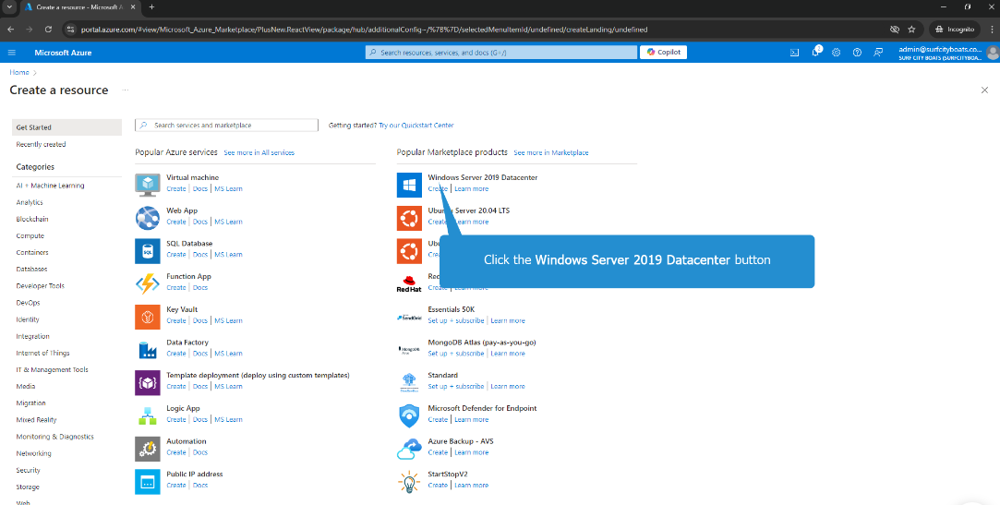
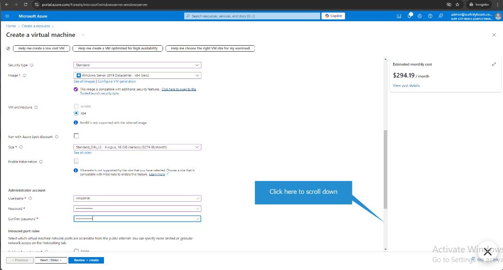
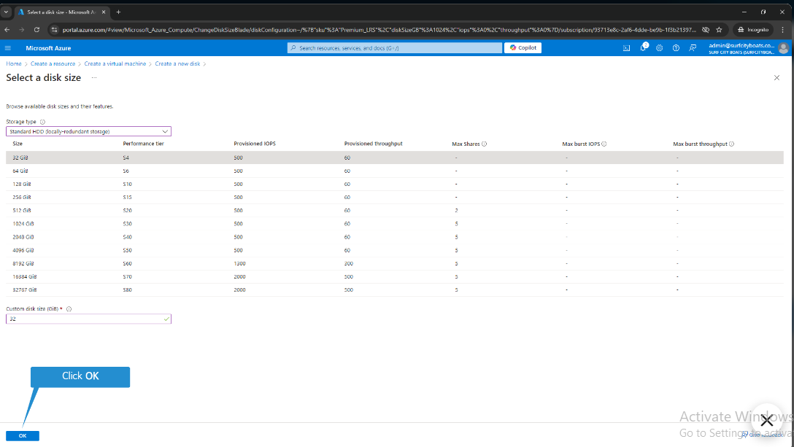
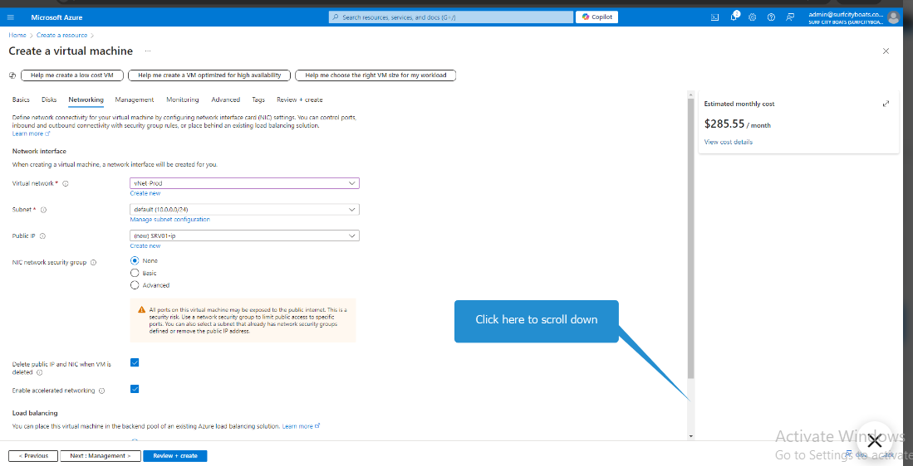
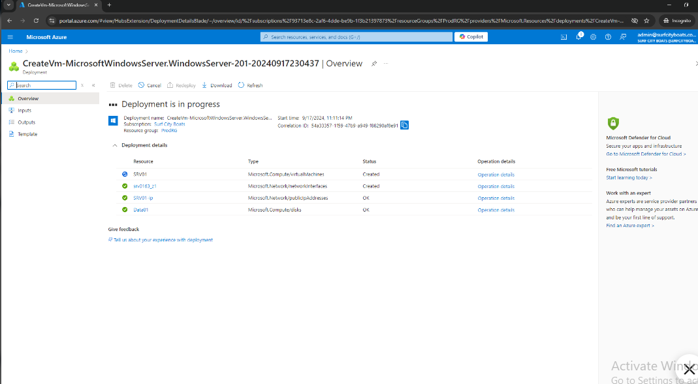

# Day 1 – Azure Virtual Machine Lab (LabITpro)

**Lab Platform:** LabITpro (simulated Azure)  
**Date:** 23 March 2026

---

## What I Did
- Followed LabITpro guided steps to create a virtual machine
- Configured VM name, region, OS image, and size
- Explored VM settings and basic storage options

---

## What I Learned 💡
- A VM is a computer in the cloud that can run applications
- Region determines where the server physically runs
- VM size affects CPU, RAM, and performance
- Storage allows persistent data on the cloud

---

## Screenshots 🖼️
 
 

---

## Challenges / Confusions ⚠️
- VM options like storage type were a bit confusing at first
- Networking setup is brief; need more practice

---

## Notes / Reflection 🚀
- Practicing on LabITpro helps understand Azure without a real subscription
- Ready to connect to VM and explore next steps in Day 2
